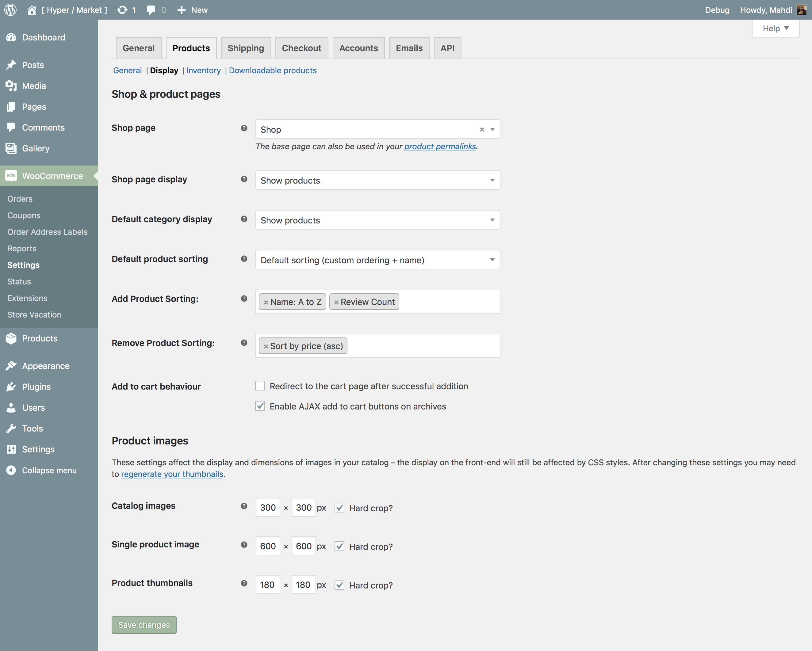

# Blurry Product Images

When your product images are blurry there are two things that could be happening. 

**One,** your image size settings may not be adequate *(too small)* for Hypermarket theme. This can cause problems as the Hypermarket theme wants an image at 954 x 782 pixels, but you are giving it one at 400 x 400 pixels.

**Two,** the original images you uploaded aren’t **high resolution enough**. Even if your image settings are right, the original image source is too small. The only thing you can do in this case is re-upload appropriate sized images to begin with.

!> For any customization and prior making any changes to the theme code, we recommend that you install [Hypermarket child theme](install-hypermarket-wordpress-child-theme). This ensures that your changes won’t be lost when updating to a new version of Hypermarket.

## Image types & sizes

* **Catalog Images:** Medium sized image used in a product loops (e.g., shop page, product category pages, related products, up-sells, cross-sells, etc.) - ```Default: 500 x 455 (px)```
* **Single Product Image:** The largest image on the individual product details page. ```Default: 954 x 782 (px)```
* **Product Thumbnails:** The smallest image, a thumbnail, commonly used underneath the Single Product Image, the cart, and widgets. ```Default: 160 x 131 (px)```

## Overwriting theme's image sizes

In your child theme’s ```functions.php``` add the below code snippet and modify the default values to meet your needs.

```php
// Single product image
function hypermarket_child_single_image_dimensions($single) {
	return array(
		'width' => '954', // px
		'height' => '782', // px
		'crop' => 1 // true
	);
}
add_filter('hypermarket_single_image_dimensions', 'hypermarket_child_single_image_dimensions', 10, 1);

// Catalog product image(s)
function hypermarket_child_catalog_image_dimensions($catalog) {
	return array(
		'width' => '954', // px
		'height' => '782', // px
		'crop' => 1 // true
	);
}
add_filter('hypermarket_single_image_dimensions', 'hypermarket_child_catalog_image_dimensions', 10, 1);

// Thumbnail product image(s)
function hypermarket_child_thumbnail_image_dimensions($thumbnail) {
	return array(
		'width' => '954', // px
		'height' => '782', // px
		'crop' => 1 // true
	);
}
add_filter('hypermarket_single_image_dimensions', 'hypermarket_child_thumbnail_image_dimensions', 10, 1);
```

## Enable settings of image sizes

When you install the [Hypermarket](https://wordpress.org/themes/hypermarket) theme, each of those settings will be set to the **recommended sizes** and since different filters are overwriting these values in the theme, settings of these image sizes have been **disabled**.

To **enable the inputs** when a filter overwrites the sizes add the below code snippet in your child theme’s ```functions.php```

```php
remove_all_filters('woocommerce_get_image_size_shop_single');
remove_all_filters('woocommerce_get_image_size_shop_catalog');
remove_all_filters('woocommerce_get_image_size_shop_thumbnail');
```

## Set image sizes

Assuming setting fields are already **enabled**, you can add new dimensions to WooCommerce to ensure that future image sizes will be rendered as expected.



* Go to **Woocommerce** » **Settings** » **Products** » **Display**.
* Scroll down on the page until you see the **Product images** section.
* Optionally, change the WooCommerce image sizes for specific needs.
* Then **Save Changes**.

Any new product images that are uploaded will now have thumbnails in these settings, and should appear without distortion or blurriness.

?> Note that saving changes does **NOT** automatically update all previously uploaded product imagery. To update old images, WordPress needs to [regenerate the thumbnails](http://wordpress.org/extend/plugins/regenerate-thumbnails). This is to ensure that all affected images are resized to match the new dimensions.
