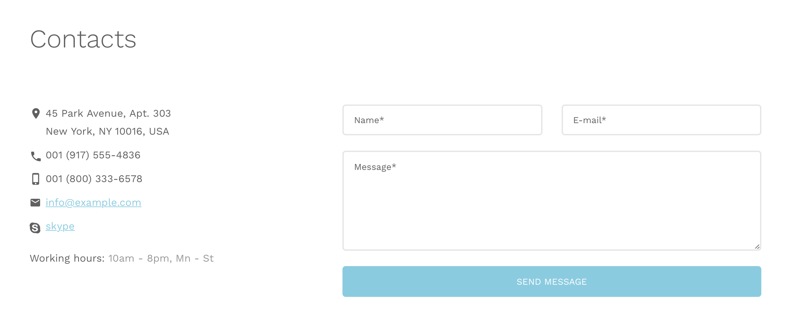
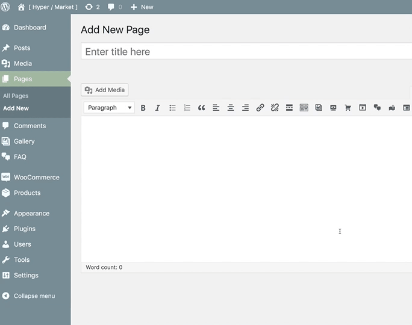

# Create contact form

This component lets you create a simple contact form using Ajax technology and advanced email address validation. All emails will be sent to **admin's email address** without page refresh.

!> Note that this component is built to keep stuff simple. If you need more advanced features such as creating complex web forms or if you need a form builder, feel free to visit [WordPress plugin repository](https://wordpress.org/plugins/search/contact+form) website and find out more about existing contact form plugins.



## Update the email address form points to

The contact form defauls to what email address you have your **admin account** with. You're going to have to change what's in there at **Dashboard** » **Users** » **Your profile**.

However, if you would like to update the email address it points to without modifying the user settings via WordPress admin panel, add the below code snippet to your [child theme](install-hypermarket-wordpress-child-theme.md)'s ```functions.php``` 

```php
function hypermarket_child_cf_to($email) {
   $email = 'info@example.com';
   return $email;
}
add_filter('hypermarket_plus_cf_to', 'hypermarket_child_cf_to', 10, 1);
```

## Spam protection

Contact form component comes with built in [honey pot](https://en.wikipedia.org/wiki/Honeypot_(computing)#) trap which is used to create a form with an extra field that is hidden to human visitors but readable by robots.

In most cases, the robot fills out the invisible field and tries to submit the form which will be prevented to send by contact form.

?> Although it's a very simple concept, it helps you to reduce spammy submissions.

## Shortcode

You can add the contact form component to any page using the ```[hypermarket-plus-contact]``` shortcode. Also, it is possible to pass the following attributes to the shortcode to create contact form elements.

```php
address_1
address_2
phone
mobile
email
hours
```

A full shortcode could look like:

```php
[hypermarket-plus-contact address_1="45 Park Avenue, Apt. 303" address_2="New York, NY 10016, USA" phone="001 (917) 555-4836" mobile="001 (800) 333-6578" email="info@example.com" hours="10am - 8pm, Mn - St"]
```



Alternatively, locate an additional button in TinyMCE’s toolbar – place the cursor where the contact form tooltip will appear, then click the **contact form button**.

After clicking the interface button, a modal dialog with a few options to config will appear, optionally fill the blanks and hit the **OK** button to generate a new contact form shortcode.
