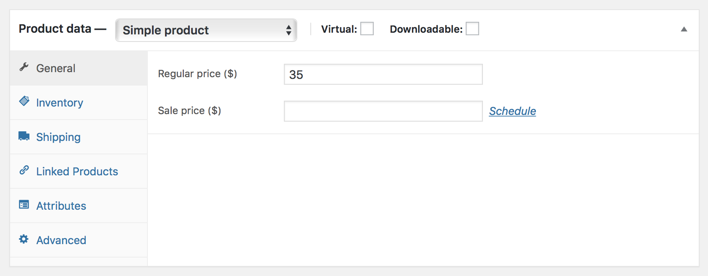

# Create product

## Type of products

* Simple Product 
*This is a single physical product that has no variations.*
* Simple Product Virtual 
*An example of this would be a service, such as hourly consulting.*
* Simple Product Downloadable 
*This is both virtual and downloadable, such as an ebook or a music file.*
* Grouped Product 
*A collection of products that are related but can be purchased separately. An example would be different models of the iMac from Apple.*
* External or Affiliate Product 
*A product your will add to your store but buyers will be sent to another site to purchase it. Affiliates work well or products you may make a commission on.*
* Variable Product 
*Some products will have different variations and multiple images. For example a t-shirt, that comes in different sizes and colors, with different prices.*

!> Note that some extensions or third-party plugins if installed will add more product date choices, such as **subscriptions**.

## Product categories

[Product categories](managing-product-categories.md) and tags work in much the same way as normal categories and tags you have when writing posts in WordPress. They can be created, edited, and selected at any time. This can be done when you first create a product or come back and edit it or the category/tag specifically.

## Attributes

These can be added per product, or you can set up **global attributes** for the entire store to use (e.g., in layered navigation).

## Adding a simple product

Adding a simple product is similar to [writing a post](create-post.md) in WordPress. Hover over the **Products** menu, then select **Add Product**. You then have a familiar interface and should immediately feel at home.

Under the editor is the Product Type panel. Define the product type (as outlined above) and whether it is a downloadable (digital) or virtual (service) product.

?> Note that virtual products **don’t require shipping** — an order containing virtual products won’t calculate any shipping costs.

## Product data

The Product Data meta box is where the majority of important data is added for your products.

* **SKU** – Stock keep unit (SKU) tracks products. Must be unique and should be formatted so it does not match any post IDs. For example, post IDs are numbers so a SKU could be WS01. That could stand for WooShirt 01.
* **Price** 
  * **Regular Price** – Item’s normal/regular price.
  * **Sale Price** – Item’s discounted price that can then be scheduled for certain date ranges.
* The **inventory section** allows you to manage stock for the product individually and define whether to allow back orders and more. If stock management is disabled from the settings page, only the *Manage stock?* option is visible.
* **Shipping**
  * **Weight** – Weight of the item.
  * **Dimensions** – Length, width and height for the item.
  * **Shipping Class** – Shipping classes are used by certain shipping methods to group similar products.
* Using **up-sells** and **cross-sells**, you can cross promote your products. 
*Up-sells are displayed on the product details page.* 
*Cross-sells are products that are displayed with the cart and related to the user’s cart contents.*
