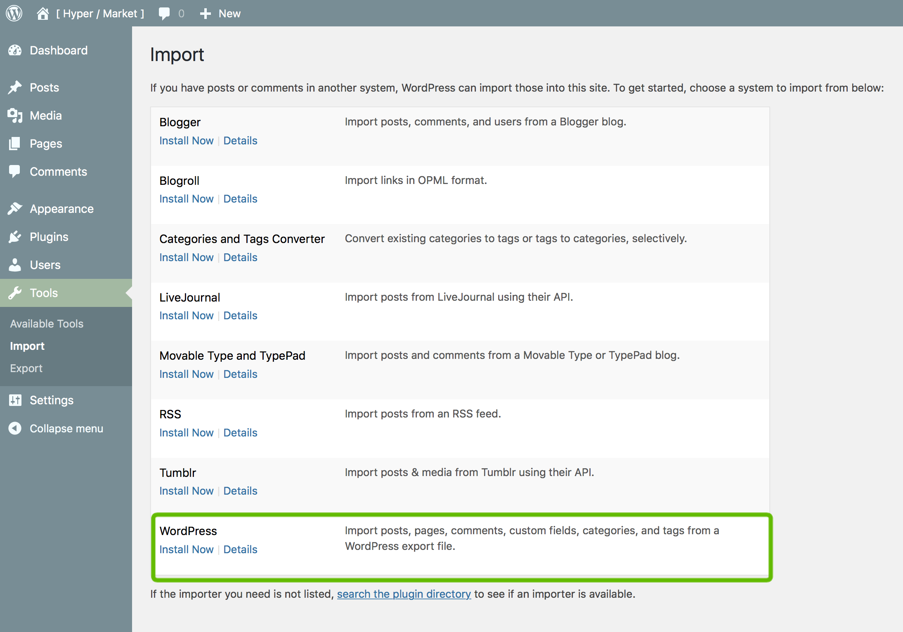

# Importing Dummy Data

Right after installing a fresh copy of [Hypermarket](https://wordpress.org/themes/hypermarket/) theme and [WooCommerce plugin](https://wordpress.org/plugins/woocommerce/) you may find you have an empty store. There are no products, orders, reviews, and more by default. We’ve done that so you can get started right away creating your own products and setting up WooCommerce exactly for the needs of your store.

This sample data for WooCommerce is located in a file called dummy-data.xml, which is located in the WooCommerce plugin folder under ```woocommerce/dummy-data/```. You can certainly re-download WooCommerce to your computer, or get the file from your server via SFTP, etc…, but the easiest might be to just right click and [download it from here](https://plugins.svn.wordpress.org/woocommerce/tags/3.0.0/dummy-data/dummy-data.xml?dl=1).

!> We do not supply the exact images you see on our Hypermarket demo within the WooCommerce Dummy Data as the pictures of the site cannot be redistributed due to copyright restrictions and are for demo purposes only. The WooCommerce Dummy Data instead comes with our unique unrestricted images that we can redistribute within product import data.

!> We do not recommend this if you have existing content in your WordPress installation, as it will add numerous posts, pages, categories, media and more to your site. Also, we recommend replacing all content as soon as possible to avoid negative SEO effects or image licensing repercussions.



* Navigate to **Tools** » **Import** and select the WordPress option.
* If you don’t have the WordPress importer installed, first install it by selecting **Install Now**.
* Once it’s installed select **Run Importer**.
* Download [WooCommerce dummy data XML](https://plugins.svn.wordpress.org/woocommerce/tags/3.0.0/dummy-data/dummy-data.xml?dl=1) file to your computer.
* Select the **Choose file** button and then select the dummy-data.xml file you downloaded earlier.
* Select the **Upload file** and click the **import** button.
* Create a new user, or assign the posts to an existing user.
* **Check** or **uncheck** the Download and import file attachments checkbox.<br/>
*This will import all the sample product images to your site if checked.*
* Click **Submit** and your dummy data will be imported.
