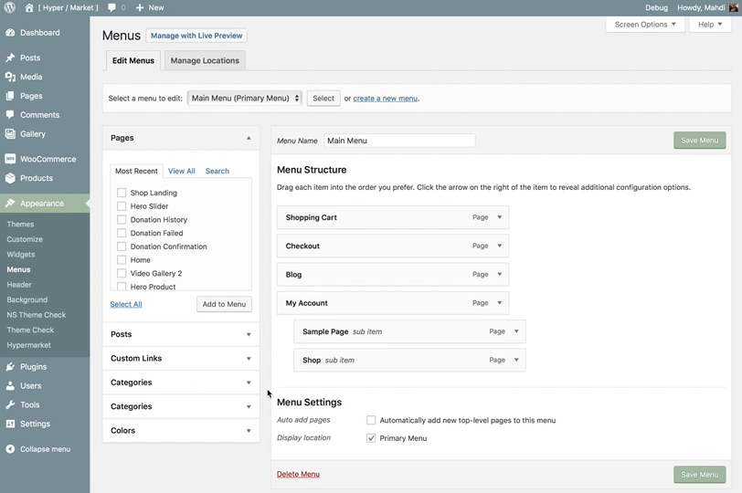

# Creating your menu

Hypermarket theme has only one menu location. The **primary navigation** appears to the right of the site logo adjacent to the user login and WooCommerce mini cart icon *(assuming WooCommerce is active)*.

## Defining a menu

* Start by visiting **Appearance** » **Menus**.
* Select **Create a new menu** at the top of the page.
* Enter a name for your new menu in the **Menu Name** box.
* Click the **Create Menu** button and your new custom menu has now been defined.

## Adding items to a menu

You can add different link types into your menu, these are split between panes left of the menu you're currently editing.

?> The **screen options** allow you to choose which items you can use to add to a menu. Certain items, like **Posts** are hidden by default. The screen options are located in the top right corner of your WordPress dashboard.

* Locate the pane entitled **Pages**.
* Within this pane, select the **View All** link to bring up a list of all the currently **published pages** on your site.
* Select the pages that you want to add by **clicking the checkbox** next to each page's title.
* Click the **Add to Menu** button located at the bottom of this pane to add your selection(s) to the menu that you created in the previous step.
* Click the **Save Menu** button once you've added all the menu items you want.

## Deleting a menu item

* Locate the menu item that you want to remove in the menu editor window.
* Click on the **arrow icon** in the top right-hand corner of the menu item to expand it.
* Click on the **Remove** link. The menu item will be immediately removed.
* Click the **Save Menu** button to save your changes.

## Assigning your menu to a location

* Scroll to the bottom of the menu editor window.
* In the section titled **display location**, click the check box for the **Primary Menu** location.
* Click **Save Menu** once you've made your selection.

## Adding a my-account icon to menu

WordPress comes with built-in functionality to manage user registrations. By default, it is turned off, but you can quickly turn it on.
* Head over to **Settings** » **General** page in your WordPress admin area. 
* Scroll down to the **Membership** section and check the box next to **Anyone can register** option.
* Next you need to select the default user role. This is the user role assigned to each new user who registers on your website, in most cases it should be a **Customer** *(assuming WooCommerce is active)*.
